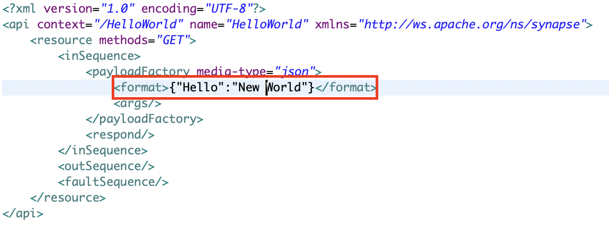
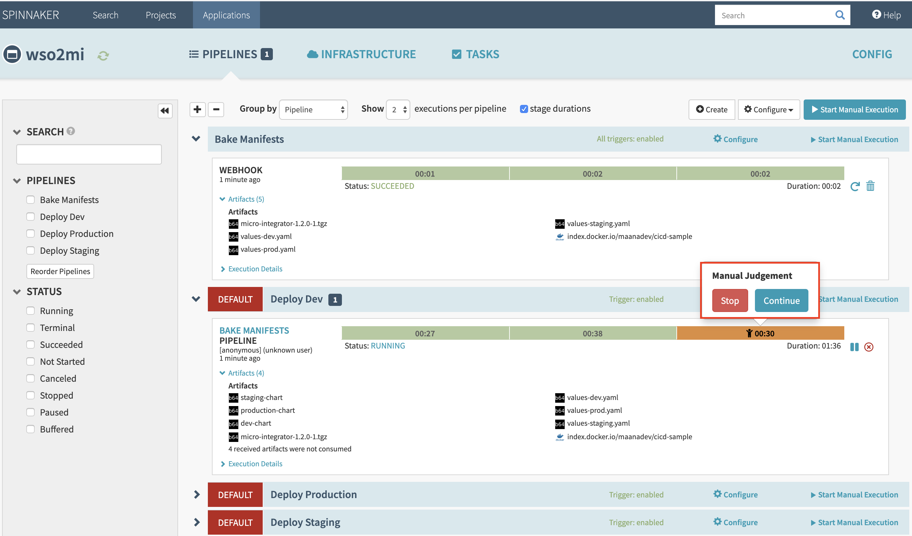
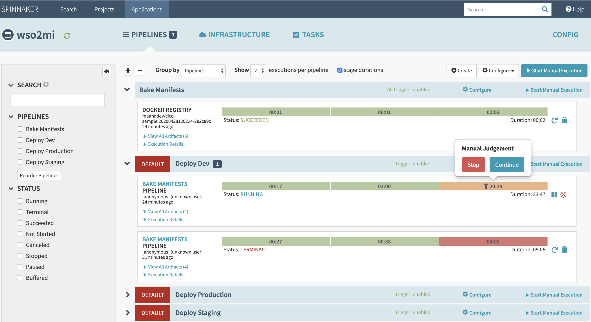

# Deploy Your Own Artifact
It is possible to deploy your own artifacts into the environments through the Kubernetes pipeline. 
This is done by providing a custom Dockerfile as shown in the steps below:

1.  Fork the [CICD sample](https://github.com/wso2-incubator/cicd-sample-docker-mi) repository that contains a [Maven
    Multi-Module
    project](../../../../develop/create-integration-project/).

2.  Update the repositories in the  [sample values](https://raw.githubusercontent.com/wso2/kubernetes-pipeline/master/kubernetes-pipeline/samples/values-mi.yaml) file
    used in the  [Pipeline Quick Start Guide](../pipeline-quick-start-guide/) to
    include the forked repository in place of `[git-username]` as
    highlighted below:
    
    ``` yaml
    applications:
    - name: wso2mi
     email: <EMAIL>
    testScript:
        path: tests
        command: test.sh
    chart:
    customChart: false
    name: micro-integrator
    version: 1.2.0-3
    repo: 'https://github.com/wso2-incubator/cicd-sample-chart-mi'
    images:
        - organization: *reg_username
        repository: wso2mi
         deployment: wso2microIntegrator
        wso2microIntegrator:
            baseImage: 'wso2/wso2mi:1.2.0'
            gitRepository: 'https://github.com/[git-username]/cicd-sample-docker-mi'
            remoteSynapseTestServer:
            enabled: false
            hostname: ''
            port: 9008 
    ```

3.  Upgrade the Helm chart with the command below.
    
    ``` bash
    $ helm upgrade <RELEASE_NAME> wso2/kubernetes-pipeline -f values-mi.yaml
    ```

    !!! Info
        This may take up to 10 minutes.


4.  Restart the Jenkins pod by deleting the existing pods. This will
    cause the cluster to spawn a new pod for Jenkins.
    
    ``` xml
    $ POD_NAME=`kubectl get pods --selector=app=jenkins -n <NAMESPACE> -o 
    json -o jsonpath='{ .items[0].metadata.name }'`
    
    $ kubectl delete pod $POD_NAME -n <NAMESPACE>
    ```
    
    Replace **<NAMESPACE\>** with the namespace in your cluster.

5.  Create a clone of the forked artifact source repository as follows:

    ``` xml
    $ git clone https://github.com/[git-username]/cicd-sample-docker-mi.git
    ```
    
    Replace the `[git-username]` tag with the name of your GitHub username.

6. Modify the API located at **cicd-sample-docker-mi>helloworldConfigs/src/main/synapse-config/apis/HelloWorld.xml**
 to return a new response as below:
    
    [ ](../../../assets/img/k8s_pipeline/Deploying/deploy-mi1.png)

7.  Commit and push the changes into your forked repository.

8.  If you have completed the steps in [Testing The Pipeline
    Environment](../testing-the-pipeline-environment/) document,
    stop the manual judgment and watch the sample artifact being deployed in the Spinnaker dashboard.
    
    [](../../../assets/img/k8s_pipeline/Deploying/deploy-mi2.png)
    [](../../../assets/img/k8s_pipeline/Deploying/deploy-mi3.png)
    [](../../../assets/img/k8s_pipeline/Deploying/deploy-mi4.png)

9.  Invoke the service 
    
    ``` bash
    curl -k https://mi.dev.wso2.com/services/HelloWorld  
    ```


10. You will get the following response: `{"Hello":"New World"}`
