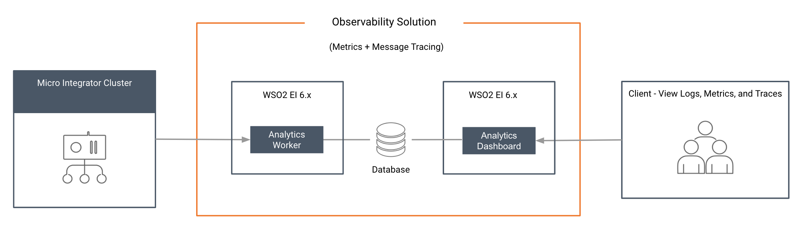

<<<<<<< HEAD
# Setting Up the Classic Observability Deployment

This section provides you instructions to set up the Classic Observability Deployment Solution. This is one of the two observability solutions offered by WSO2 EI. This solution is more suitable if you already have an observability stack such as ELK,  or if you want more business analytics and less operational observability. For morer information about the observability solution, see [Observability Overview](observability-with-grafana-overview.md).

## System requirements

- For EI nodes, see [Installation Prerequisites](../../setup/installation/install_prerequisites).

- For the Analytics worker:
=======
# Setting up the EI Analytics Profile for Observability
Follow the instructions given below to enable observability for your Micro Integrator deployment using the [Analytics profile of WSO2 EI 6.6.0](https://docs.wso2.com/display/EI660/Using+the+WSO2+EI+Analytics+Profile). 



The Analytics profile consists of two components: **Worker** and **Dashboard**. The worker is the server that processes the data streams that are sent from the Micro Integrator and publishes the statistics to a database. The dashboard reads the statistics published by the worker and displays the statistics. The worker and dashboard are connected through the database.

This solution is more suitable if you already have an observability stack such as ELK,  or if you want more business analytics and less operational observability. To select the most appropriate observability solution for your deployment, see [Observability Deployment Strategy](../../../setup/observability/observability-deployment-strategy).

## System requirements

You will be running three servers (analytics worker, analytics dashboard, and the Micro Integrator) for this solution. Be sure that you have the required system specifications to run each server.

-   For the Analytics **Worker**:
>>>>>>> 1e62e069fd75a43881230556dbfa19e9065086de

    <table>
    <tbody>
    <tr class="odd">
    <th>Memory</th>
    <td><p><ul><li>~ 2 GB per worker node (and therefore, 4 GB for the recommended Minimum HA cluster<li>2 CPU cores minimum. It is recommended to allocate 4 cores.</li></li><li>~ 2 GB is the initial heap (-Xms)  required for the server startup. The maximum heap size is 4 GB (-Xmx)</li></ul></p></td>
    </tr>
    <tr class="even">
    <th>Disk</th>
    <td><p><li>~ 480 MB, excluding space allocated for log files and databases.</li></p></td>
    </tr>
    </tbody>
    </table>

<<<<<<< HEAD
- For the Analytics Dashboard:
=======
-   For the Analytics **Dashboard**:
>>>>>>> 1e62e069fd75a43881230556dbfa19e9065086de

    <table>
    <tbody>
    <tr class="odd">
    <th>Memory</th>
    <td><p><ul><li>~ 2 GB minimum, 4 GB Maximum<li>2 CPU cores minimum. It is recommended to allocate 4 cores.</li></li><li>~ 512 MB heap size. This is generally sufficient to process typical SOAP messages but the requirements vary with larger message sizes and  the number of messages processed concurrently.</li></ul></p></td>
    </tr>
    <tr class="even">
    <th>Disk</th>
    <td><p><li>~ 480 MB, excluding space allocated for log files and databases.</li></p></td>
    </tr>
    </tbody>
    </table>
<<<<<<< HEAD
    

## Setting up the Analytics Dashboard

### Configuring the Micro Integrator

To enable statistics monitoring for the Micro Integrator, add the following parameters in the `deployment.toml` file of your Micro Integrator. This file is stored in the `MI_HOME/conf`.

!!! Tip
    When you run the embedded Micro Integrator of [WSO2 Integration Studio](../../develop/installing-WSO2-Integration-Studio), the `MI_HOME/conf` directory is as follows: `MI_TOOLING_HOME/Contents/Eclipse/runtime/microesb/conf/` (in MacOS/Linux/CentOS) or `MI_TOOLING_HOME/runtime/microesb/conf` (in Windows) directory. 
=======

-   For the Micro Integrator, see the [installation prerequsites](../../../setup/installation/install_prerequisites).

## Download the servers

-   Download and [install WSO2 EI 6.6.0](https://docs.wso2.com/display/EI660/Installing+the+Product). 

    !!! Tip
        You will use the Analytics servers from this distribution.

    The location of your WSO2 EI 6.x.x installation will be referred to as `<EI_6.x.x_HOME>`.

-   Download and [install the Micro Integrator](../../../setup/installation/install_in_vm_installer) of EI 7.1. 
    

## Configuring the Micro Integrator

### Configure SSL certificates

!!! Warning
    Be sure to configure this step before starting the Micro Integrator.

To allow the Micro Integrator server and the Analytics server to communicate using SSL, the digital certificates should be shared by the two servers. See the instructions on [adding SSL certificates to keystores](../../../setup/security/importing_ssl_certificate).
    
For testing, you can simply copy the keystore files from the `<EI_6.x.x_HOME>/wso2/analytics/resources/security` directory to the `MI_HOME/resources/security` directory.

### Enabling statistics monitoring

To enable statistics monitoring for the Micro Integrator, add the following parameters in the `deployment.toml` file of your Micro Integrator. This file is stored in the `MI_HOME/conf`.
>>>>>>> 1e62e069fd75a43881230556dbfa19e9065086de

```toml
[mediation]
flow.statistics.enable=true
stat.tracer.collect_payloads=true
stat.tracer.collect_mediation_properties=true
```

<<<<<<< HEAD
### Enabling statistics for artifacts

You must enable statistics/tracing for the integration artifacts that you wish to monitor.

#### Enabling statistics for ALL artifacts
=======
### Enabling statistics for ALL artifacts
>>>>>>> 1e62e069fd75a43881230556dbfa19e9065086de

If you want to collect statistics for **all** your integration artifacts, be sure to add the following parameter to the `deployment.toml` file in addition the [parameters explained above](#configuring-the-micro-integrator):

```toml
[mediation]
flow.statistics.capture_all=true
```

Alternatively, you can enable statistics for selected artifacts as explained below.

<<<<<<< HEAD
#### Enabling statistics for specific artifacts

Let's use the integration artifacts from the [service chaining](../../use-cases/tutorials/exposing-several-services-as-a-single-service) tutorial.
=======
### Enabling statistics for specific artifacts

Let's use the integration artifacts from the [service chaining](../../../use-cases/tutorials/exposing-several-services-as-a-single-service) tutorial.
>>>>>>> 1e62e069fd75a43881230556dbfa19e9065086de

!!! Warning
    It is not recommended to enable **tracing** in production environments as it generates a large number of events that reduces the performance of the analytics profile. Therefore, tracing should only be enabled in development environments.

<<<<<<< HEAD
If you did not try the [service chaining](../../use-cases/tutorials/exposing-several-services-as-a-single-service) tutorial yet:

1.  Download the [pre-packaged project](https://github.com/wso2-docs/WSO2_EI/blob/master/Integration-Tutorial-Artifacts/Integration-Tutorial-Artifacts-EI7.1.0/service-orchestration-tutorial.zip) for the **service chaining** use case.
2.  [Open WSO2 Integration Studio](../../develop/installing-WSO2-Integration-Studio) and [import the pre-packaged project](../../develop/importing-projects).
=======
If you did not try the [service chaining](../../../use-cases/tutorials/exposing-several-services-as-a-single-service) tutorial yet:

1.  Download the [pre-packaged project](https://github.com/wso2-docs/WSO2_EI/blob/master/Integration-Tutorial-Artifacts/Integration-Tutorial-Artifacts-EI7.1.0/service-orchestration-tutorial.zip) for the **service chaining** use case.
2.  [Open WSO2 Integration Studio](../../../develop/installing-WSO2-Integration-Studio) and [import the pre-packaged project](../../../develop/importing-projects).
>>>>>>> 1e62e069fd75a43881230556dbfa19e9065086de

Follow the steps below to enable statistics and tracing for the **REST API** artifact:

1.  Select `HealthcareAPI` in the canvas of WSO2 Integration Studio to open the **Properties** tab.
2.  Select **Statistics Enabled** and (if required) **Trace Enabled** as shown below.
<<<<<<< HEAD
     
=======
     
>>>>>>> 1e62e069fd75a43881230556dbfa19e9065086de

Follow the steps below to enable statistics for the **endpoint** artifacts:

1.  Select the required endpoint artifacts from the project explorer. 
2.  Select **Statistics Enabled** and (if required) **Trace Enabled** as shown below.
<<<<<<< HEAD
     
=======
     

## What's Next?

If you have successfully set up your anlaytics deployment, see the instructions on [using the Analytics dashboard](../../../administer-and-observe/using-the-analytics-dashboard).
>>>>>>> 1e62e069fd75a43881230556dbfa19e9065086de
